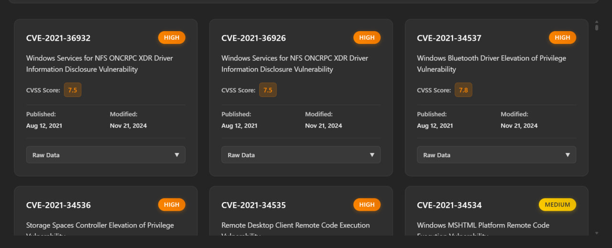

# CVE Vulnerability Tracker - RSecurity Challenge

A full-stack web application that fetches CVE data from NIST API, stores it in SQLite, and presents it through a React interface.

## Challenge Requirements ✅

- ✅ Lightweight web server (Express.js + TypeScript)
- ✅ API integration (NIST CVE API)
- ✅ Database storage (SQLite)
- ✅ UI presentation (React with virtual scrolling)
- ✅ Docker containerization on port 8080
- ✅ Smooth data presentation with filtering and responsive design

## Quick Start

```bash
# Clone and run with Docker (Recommended)
git clone git@github.com:Ronco75/RSecurity-Task.git
cd RSecurity-Task
docker-compose up --build

# Access application
# Frontend: http://localhost:8080
# API: http://localhost:8080/api
```

The application automatically:
- Creates SQLite database
- Fetches CVE data from NIST API (`https://services.nvd.nist.gov/rest/json/cves/2.0?cpeName=cpe:2.3:o:microsoft:windows_10:1607`)
- Serves React frontend with virtual scrolling for performance
- **Background processing runs every 15 seconds until all CVE data from the API is synchronized to the UI**

## Application Screenshots

### Main Interface with Filtering

*The main dashboard showing 2487 vulnerabilities with filtering options by severity and CVSS score range*

### CVE Details Grid View

*Grid view displaying individual CVE cards with severity levels, CVSS scores, and vulnerability details*

## Features

- **Virtual Scrolling**: Handles thousands of CVE records efficiently
- **Responsive Design**: Grid/list views with adaptive columns
- **Real-time Filtering**: Search by text, severity, and CVSS score
- **Auto-refresh**: Keeps CVE data synchronized
- **Background Sync**: Continuous background processing every 15 seconds ensures all API data is loaded
- **Health Monitoring**: Built-in API health checks

## API Endpoints

| Method | Endpoint | Description |
|--------|----------|-------------|
| GET | `/api/health` | Health check and database status |
| GET | `/api/cves` | Retrieve all CVE records |
| POST | `/api/cves/sync` | Trigger manual CVE data synchronization |
| GET | `/api/cves/sync/status` | Get current sync operation status |

## Development Setup

### Backend
```bash
cd backend
npm install
npm run dev  # Runs on port 8080
```

### Frontend
```bash
cd frontend
npm install
npm run dev  # Runs on port 5173
```

## Data Synchronization

The application implements automatic background synchronization:
- **Interval**: Every 15 seconds
- **Process**: Fetches new CVE data from NIST API and updates the local SQLite database
- **Continues until**: All available CVE data from the API endpoint is synchronized
- **UI Updates**: Real-time updates as new data becomes available

## Tech Stack

- **Backend**: Express.js, TypeScript, SQLite
- **Frontend**: React, TypeScript, Vite, react-window
- **Container**: Docker with multi-stage builds